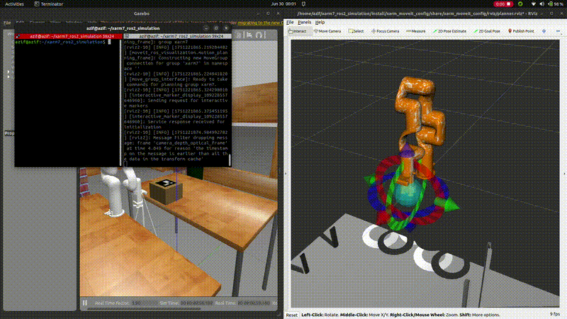

# 🦾 xarm7\_ros2\_simulation

> **Autonomous Pick-and-Place Simulation with ArUco Detection and Motion Pipeline using xArm7 in ROS 2**

---

## 📌 Overview

This project provides a full-featured **ROS 2-based simulation** for the **xArm7 robotic arm**, capable of performing **pick-and-place tasks** using **ArUco marker detection**, **MoveIt 2 motion planning**, and **Gazebo physics**.

It supports:

* ArUco-based pose detection from a RealSense camera
* Joint and Cartesian planning
* YAML-based pose saving/loading
* Object grasp simulation via Gazebo attach/detach
* Modular and service-driven pipeline execution

---

### 🎥 Simulation Preview

[](media/xarm7_simulation.gif)

---


## 🗂️ Packages

| Package            | Description                                            |
| ------------------ | ------------------------------------------------------ |
| `xarm7_bringup`    | Launch Gazebo + MoveIt 2 + RViz for xArm7              |
| `xarm7_pipeline`   | Loads poses from YAML and runs pick-and-place pipeline |
| `xarm7_pose_saver` | Saves current joint states to YAML                     |
| `xarm7_aruco_pick` | Detects ArUco markers and publishes 6D poses           |
| `msg_gazebo`       | Custom Gazebo plugin for simulated object grasping     |

---

## 🧩 Features

✅ **ArUco marker detection** from RealSense
✅ **Pipeline-based motion** with Cartesian/joint trajectory support
✅ **Pose save/load** to YAML for repeatable testing
✅ **Object attachment** using Gazebo service plugin
✅ **Clean modular design** using ROS 2 services
✅ **Visual debugging** in RViz

---

## 🛠️ Requirements

* ROS 2 Humble or newer
* Gazebo Fortress/Ignition
* [xArm ROS 2 SDK](https://github.com/xArm-Developer/xarm_ros2)
* MoveIt 2
* yaml-cpp
* RealSense camera plugins

Install dependencies:

```bash
sudo apt update
rosdep install --from-paths src --ignore-src -r -y
colcon build --symlink-install
source install/setup.bash
```

---

## 🚀 How to Run

### 1. Launch Simulation with MoveIt 2

```bash
ros2 launch xarm7_bringup xarm7_bringup.launch.py
```

This launches:

* xArm7 robot in Gazebo
* Move Group node (MoveIt 2)
* RViz visualization
* RealSense camera

---

### 2. Save Poses (Optional)

Save the robot's current joint state into a YAML file for later execution:

```bash
ros2 run xarm7_pose_saver pose_saver
```

Saved to:

```
~/xarm7_ros2_simulation/robot_data/saved_joint_poses.yaml
```

---

### 3. Run ArUco Detection Node

Detect the 6D pose of an ArUco marker and publish as TF and `PoseStamped`:

```bash
ros2 run xarm7_aruco_pick aruco_detector_node
```

* Publishes TF: `link_base → aruco_og`
* Publishes topic: `/aruco_og_pose`

---

### 4. Execute Pick-and-Place Pipeline

This node will:

* Load the list of joint pose names from YAML
* Plan and execute motion in sequence
* Attach or detach the object via Gazebo service

```bash
ros2 run xarm7_pipeline xarm7_pipeline_node
```

Default step list:

```yaml
steps:
  - home
  - up
  - look
  - pick_pre
  - pick
  - attach
  - drop_post
  - drop_pre
  - drop
  - detach
  - up
  - home
```

Each pose must be defined in `saved_joint_poses.yaml`.

---

## 📡 Gazebo Attach/Detach

Attach or detach an object to the robot gripper:

```bash
ros2 service call /AttachDetach msg_gazebo/srv/AttachDetach \
  "{model1: 'UF_ROBOT', link1: 'link7', model2: 'box_2', link2: 'link', attach: true}"
```

> ✅ **Proximity check**: The plugin only attaches if distance < **2.5 cm** between the links.

---

## 📷 ArUco Marker Tips

* Use `4x4_1000` dictionary
* Ensure marker mesh is properly scaled in `.dae` (e.g., 1.0 x 1.0 meters if specified in simulation)
* Confirm camera frame is `camera_color_optical_frame` for TF lookups

---

## 🧪 Debugging

* View TF tree in RViz2
* Echo marker pose:

```bash
ros2 topic echo /aruco_og_pose
```

* Check planning status via terminal logs
* Use `ros2 service call /xarm_joint_plan` to test joint planning

---

## 📁 Example YAML

```yaml
home: [0.0, -0.5, 0.0, -1.57, 0.0, 1.57, 0.0]
pick_pre: [0.1, -0.6, 0.2, -1.4, 0.0, 1.5, 0.0]
pick: [0.12, -0.5, 0.25, -1.6, 0.0, 1.57, 0.0]
drop_pre: [-0.1, -0.6, -0.2, -1.4, 0.0, 1.5, 0.0]
drop: [-0.12, -0.5, -0.25, -1.6, 0.0, 1.57, 0.0]
```

---

## 🧑‍💻 Author & Contact

**Mohammed Azif**
📧 Email: [syedazif321@gmail.com](mailto:syedazif321@gmail.com)

---

## 📜 License

This project is licensed under the [MIT License](LICENSE).
